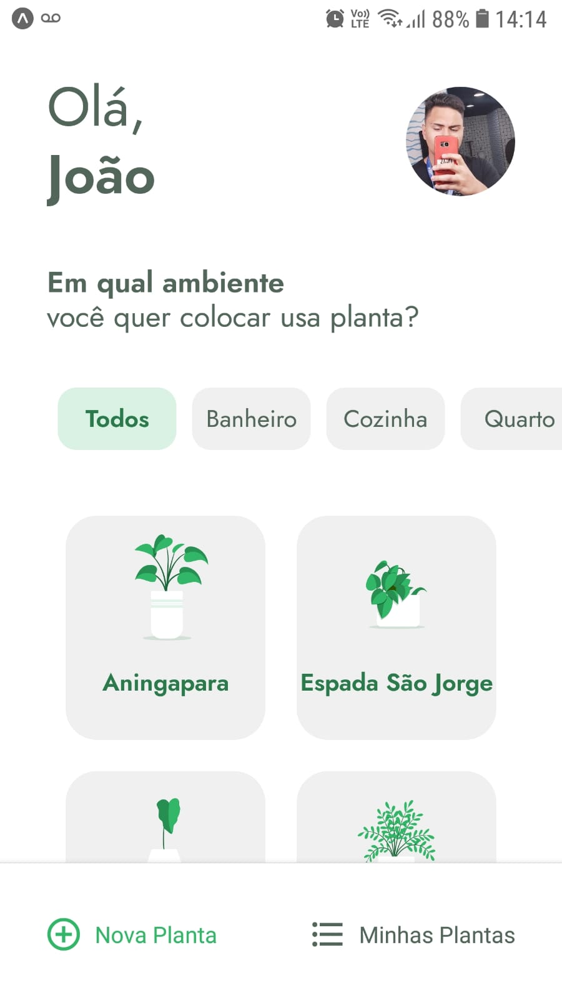

 # <center>   PlantManager</center>

<div style="display:flex; gap: 2rem; margin-bottom: 2rem;"> 


</div>


## ⚡ Tecnologias

  Esse projeto foi desenvolvido com as seguintes tecnologias:

  - [React Native](https://reactnative.dev/)
  - [Expo](https://expo.io/)
  - [Lottie](https://lottiefiles.com/)

## 💻 Projeto
  O projeto PlantManager desenvolvido durante a NLW da Rocketseat, é uma aplicação com
	o objetivo de ajudar as pessoas a se lembrarem de cuidar das suas plantinhas.
  Você seleciona a planta e a hora de regar e toda vez que necessário o app enviará
  notificações para você regar determinada planta.

## 📁 Scripts

- Para instalar as dependências use esse comando:
```
yarn
```
(Caso não possua o yarn siga esta documentação de como instalar: https://classic.yarnpkg.com/en/docs/install/#windows-stable)

- Para iniciar o projeto no navegador utilize este comando:
```
yarn start

ou

expo start
```
